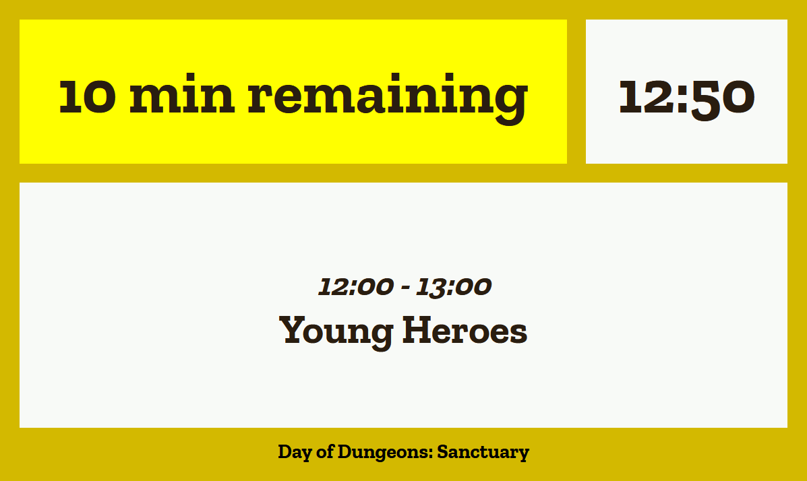

# Confidence Monitor

A confidence monitor is a screen that supports a presenter with useful information during their presentation. This project contains a simple web interface that shows the current time, time remaining and name of a currently active talk within a schedule. When a talk is nearing its end, a flashing warning is given before the end: yellow at 10 minutes, orange at 5 minutes and red at the very end.

## How to deploy

You can [download all project files at once](https://github.com/Glodenox/confidence-monitor/archive/master.zip) and extract this zip file on the system where you want to display the confidence monitor. You should only need to adjust the `configuration.js` file with your own schedule. It is perfectly possible to use a very small computer to host this interface. A Raspberry Pi with [FullPageOS](https://github.com/guysoft/FullPageOS) works very well, for example.

## State of the project

It is already useable in its current form, but it might be a bit of a bumpy experience. Mostly consider this as a base to start from when you are looking at implementing your own confidence monitor.
